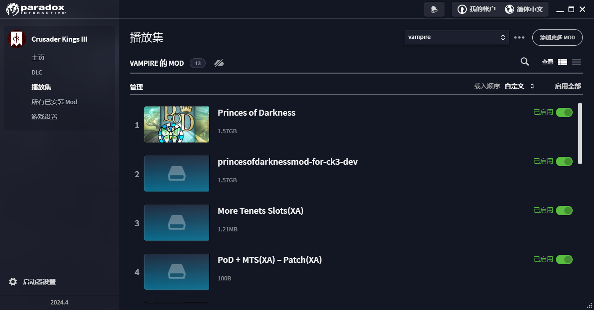

# ck3 mod more_tenant_slots

### **more_tenets_slots_xa_dev** folder: 

This mod adds more tenant slots to the game.

It is modified from modified original mod.

Source codes: https://github.com/XenoAmess/ck3_mod_more_tenant_slots

Original mod: https://steamcommunity.com/sharedfiles/filedetails/?id=2904268802

This mod: https://steamcommunity.com/sharedfiles/filedetails/?id=3182367229

Special thanks to https://steamcommunity.com/sharedfiles/filedetails/?id=2904268802 and its author Holger

This version is different as we expand the number ot max tenets from 20 to 100

We also do DEFAULT_MAX_TRADITIONS = 10000 to enlarge the tradition slots.

###  **pod_mts_xa_patch_xa_dev** folder:

It is the MTS patch for Princes of Darkness mod.

It is modified from modified original mod, and standalone(don't need any other MTS mod with it)

source codes: https://github.com/XenoAmess/ck3_mod_more_tenant_slots

original mod: https://steamcommunity.com/sharedfiles/filedetails/?id=2890708074

this mod: https://steamcommunity.com/sharedfiles/filedetails/?id=3182385109

POD mod: https://steamcommunity.com/sharedfiles/filedetails/?id=2216659254

### order

